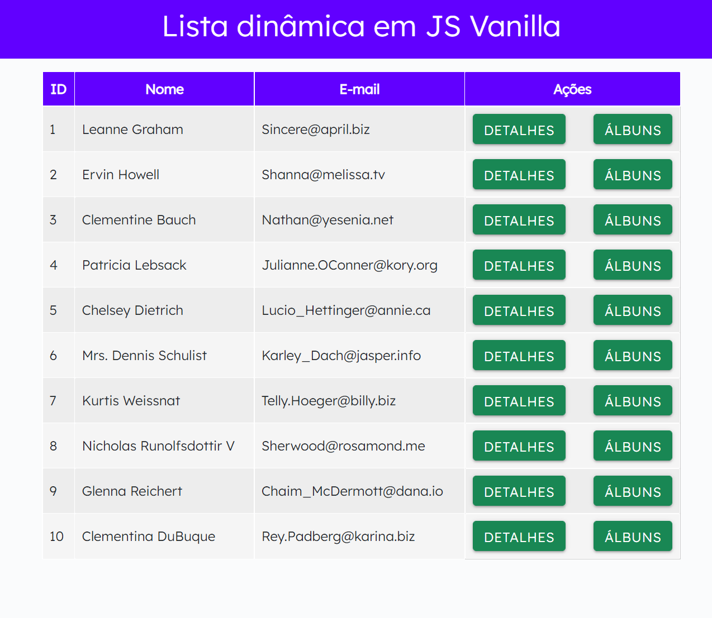

# fake-app-javascript-queryString Responsivo

 
Criado uma página que manipula os dados de uma api fake.Onde contém uma Home para listar todos os usuários,página Detalhes que lista os usuários individualemente como: ID, nome e email. Botões de voltar e link para foto.

## Pré-visualização:

[fake-app-javascript-queryString](https://fake-app-javascript-query-string.vercel.app/)

